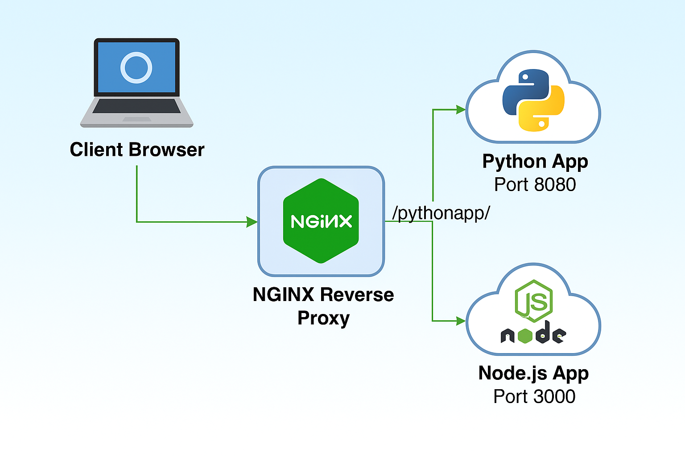

# NGINX Reverse Proxy Implementation on AWS

## Project Overview

This project demonstrates the implementation of an NGINX reverse proxy server on AWS to route traffic to multiple backend services. The reverse proxy provides a unified access point for two different applications:

1. A Python application running on port 8080
2. A Node.js application running on port 3000

By using NGINX as a reverse proxy, we can access both applications through a single IP address while keeping the actual service ports secured from public access.

## What is a Reverse Proxy?

A reverse proxy is a server that sits between clients and backend application servers. It forwards client requests to appropriate backend servers and returns the server's responses to the clients, appearing as the origin server to clients.

### Key Benefits:
- **Security**: Hide backend services and ports from public access
- **Unified Access**: Access multiple applications through a single entry point
- **Path-Based Routing**: Direct traffic to different applications based on URL paths
- **Simplified Client Experience**: Clients don't need to remember different ports for different services

## System Architecture



If the diagram doesn't render properly, here's a text representation of the architecture:

```
                     ┌─────────────┐
                     │    Client   │
                     └──────┬──────┘
                            │
                            ▼
                    ┌───────────────┐
 Public Access      │     AWS EC2   │
 Port 80 ───────────►  NGINX Server │
                    └───────┬───────┘
                            │
                 ┌──────────┴──────────┐
                 │                     │
                 ▼                     ▼
        ┌─────────────────┐   ┌─────────────────┐
        │  Python Server  │   │  Node.js Server │
        │  (Port 8080)    │   │   (Port 3000)   │
        │  [Firewalled]   │   │  [Firewalled]   │
        └─────────────────┘   └─────────────────┘
```

## Implementation Steps

### 1. AWS Setup

- Launched an EC2 instance with Ubuntu Server
- Configured Security Group to allow:
  - SSH (Port 22) for administration
  - HTTP (Port 80) for web traffic
  - Initially allowed ports 8080 and 3000 for testing direct access

### 2. Backend Services Setup

Created two backend services in separate directories:

#### Service 1: Python Application
```bash
mkdir service1
# Start Python server on port 8080
# Simple HTTP server for demonstration
```

#### Service 2: Node.js Application
```bash
mkdir service2
# Start Node.js server on port 3000
# Express application for demonstration
```

### 3. Direct Access Testing

Tested direct access to both services through their respective ports to ensure they were functioning correctly:
- Python app: http://13.247.213.192:8080
- Node.js app: http://13.247.213.192:3000


### 4. Security Enhancement

Secured the backend services by blocking direct access to ports 8080 and 3000 using UFW (Uncomplicated Firewall):

```bash
sudo ufw deny 8080
sudo ufw deny 3000
sudo ufw allow 80
sudo ufw status
```

Verified that direct access to the services was no longer possible:


### 5. NGINX Installation

```bash
sudo apt update
sudo apt install nginx
```

### 6. NGINX Configuration

Created a custom configuration file in the sites-available directory:

```bash
sudo nano /etc/nginx/sites-available/reverse-proxy
```

Added the following configuration:

```nginx
# Main server block configuration
server {
    # Listen on port 80 for HTTP traffic
    listen 80;
    # Set the server name to the IP address
    server_name 13.247.213.192;
    
    # Configuration block for Python application
    # Handles all requests under /pythonapp/ path
    location /pythonapp/ {
        # Forward requests to Python application running on localhost port 8080
        proxy_pass http://127.0.0.1:8080/;  # Added trailing slash
        
        # Standard proxy headers section
        # Pass the original host header to the backend
        proxy_set_header Host $host;
        # Pass the real client IP address
        proxy_set_header X-Real-IP $remote_addr;
        # Pass the proxy chain information
        proxy_set_header X-Forwarded-For $proxy_add_x_forwarded_for;
        # Pass the original protocol (http/https)
        proxy_set_header X-Forwarded-Proto $scheme;
        
        # Performance optimization settings
        # Enable proxy buffering for better performance
        proxy_buffering on;
        # Set the size of the proxy buffer
        proxy_buffer_size 4k;
        # Configure number and size of proxy buffers
        proxy_buffers 8 16k;
        # Set timeout for establishing connection
        proxy_connect_timeout 60s;
        # Set timeout for sending data
        proxy_send_timeout 60s;
        # Set timeout for reading response
        proxy_read_timeout 60s;
    }
    
    # Configuration block for Node.js application
    # Handles all requests under /nodejsapp/ path
    location /nodejsapp/ {
        # Forward requests to Node.js application running on localhost port 3000
        proxy_pass http://127.0.0.1:3000/;  # Trailing slash already present
        
        # Standard proxy headers section
        # Pass the original host header to the backend
        proxy_set_header Host $host;
        # Pass the real client IP address
        proxy_set_header X-Real-IP $remote_addr;
        # Pass the proxy chain information
        proxy_set_header X-Forwarded-For $proxy_add_x_forwarded_for;
        # Pass the original protocol (http/https)
        proxy_set_header X-Forwarded-Proto $scheme;
        
        # Performance optimization settings
        # Enable proxy buffering for better performance
        proxy_buffering on;
        # Set the size of the proxy buffer
        proxy_buffer_size 4k;
        # Configure number and size of proxy buffers
        proxy_buffers 8 16k;
        # Set timeout for establishing connection
        proxy_connect_timeout 60s;
        # Set timeout for sending data
        proxy_send_timeout 60s;
        # Set timeout for reading response
        proxy_read_timeout 60s;
    }
    
    # Define custom error pages for server errors
    error_page 500 502 503 504 /50x.html;
    
    # Security header configurations
    # Prevent site from being embedded in iframes on other domains
    add_header X-Frame-Options "SAMEORIGIN";
    # Prevent MIME-type sniffing
    add_header X-Content-Type-Options "nosniff";
    # Enable browser's XSS protection
    add_header X-XSS-Protection "1; mode=block";
}
```

### 7. Enabling the Configuration

Linked the configuration to the sites-enabled directory and tested the configuration:

```bash
sudo ln -s /etc/nginx/sites-available/reverse-proxy /etc/nginx/sites-enabled/
sudo nginx -t
sudo systemctl restart nginx
```

### 8. Testing the Reverse Proxy

Verified that both applications were accessible through the NGINX reverse proxy:
- Python application: http://13.247.213.192/pythonapp/
- Node.js application: http://13.247.213.192/nodejsapp/


## Key Configuration Elements Explained

### Path-Based Routing

The configuration uses location blocks to route requests based on the URL path:
- Requests to `/pythonapp/` are routed to the Python application
- Requests to `/nodejsapp/` are routed to the Node.js application

### Proxy Headers

The `proxy_set_header` directives ensure that important information is passed to the backend servers:
- `Host`: Preserves the original host header
- `X-Real-IP`: Forwards the client's IP address
- `X-Forwarded-For`: Maintains the chain of IP addresses
- `X-Forwarded-Proto`: Indicates the original protocol (HTTP/HTTPS)

### Performance Optimization

Several settings improve proxy performance:
- `proxy_buffering`: Enables buffering of responses
- `proxy_buffer_size` and `proxy_buffers`: Configure buffer sizes
- Timeout settings: Control connection, sending, and reading timeouts

### Security Headers

Added security headers to protect against common web vulnerabilities:
- `X-Frame-Options`: Prevents clickjacking attacks
- `X-Content-Type-Options`: Prevents MIME-type sniffing
- `X-XSS-Protection`: Enables browser's built-in XSS protection

## Lessons Learned

Throughout this project, I gained hands-on experience with:

1. **NGINX Configuration**: Understanding the syntax and structure of NGINX configuration files
2. **Reverse Proxy Concepts**: Implementing path-based routing and header forwarding
3. **Server Security**: Using firewalls to restrict direct access to backend services
4. **AWS Infrastructure**: Deploying and configuring services on EC2 instances

## Future Improvements

Possible enhancements for this project:

1. **SSL/TLS Implementation**: Adding HTTPS support with Let's Encrypt
2. **Load Balancing**: Expanding to multiple backend instances for each service
3. **Monitoring**: Implementing NGINX status monitoring
4. **Caching**: Adding caching for static content
5. **Automated Deployment**: Creating scripts for automated setup and configuration

## Conclusion

This project demonstrates a practical implementation of an NGINX reverse proxy on AWS, providing a secure and unified way to access multiple backend services. By hiding the backend services behind the reverse proxy and implementing proper routing, we've created a more secure and user-friendly system.


## Repository Structure

```
/
├── README.md                 # This documentation file
├── imgs/                     # Directory for all images
│   ├── architecture/         # System architecture diagrams
│   │   ├── draw-io-diagram.png
│   │   └── ai-generated-arch.png
│   └── testing/              # Testing screenshots
│       ├── direct-port-access.png
│       ├── blocked-ports.png
│       └── nginx-access.png
├── nginx/
│   └── reverse-proxy         # NGINX configuration file
├── apps/
│   ├── python-app/           # Python application code
│   └── nodejs-app/           # Node.js application code
└── scripts/
    └── firewall-rules.sh     # Firewall configuration
```
